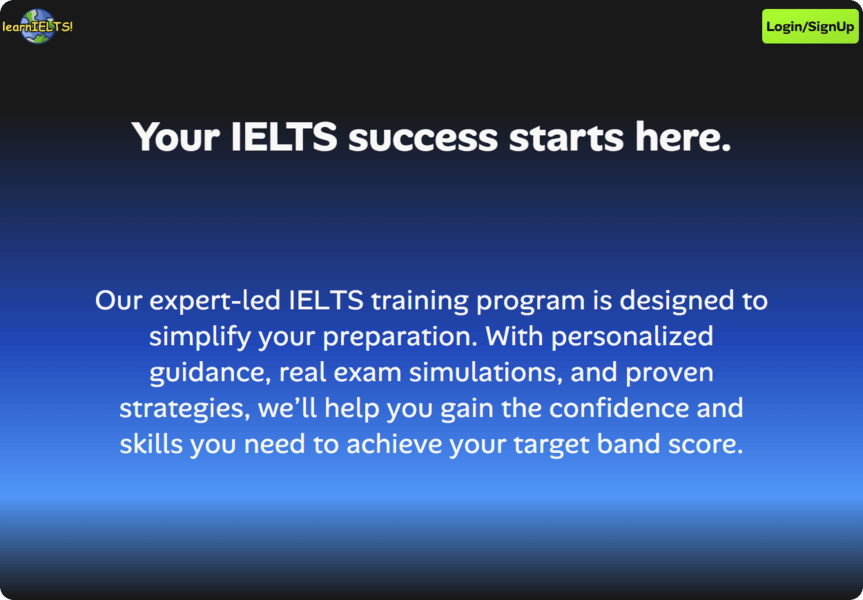
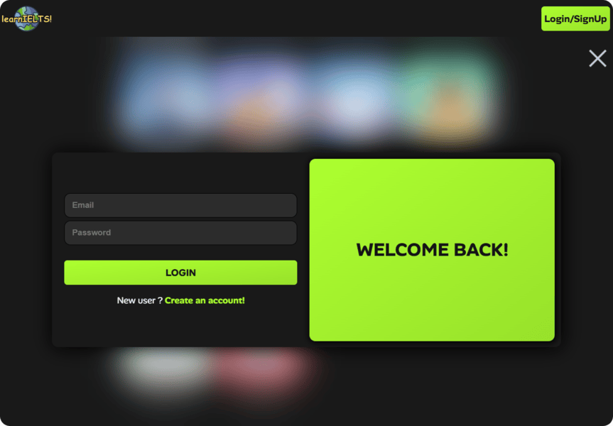
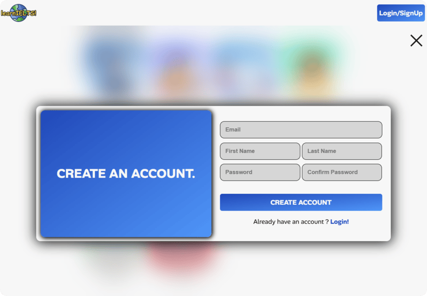
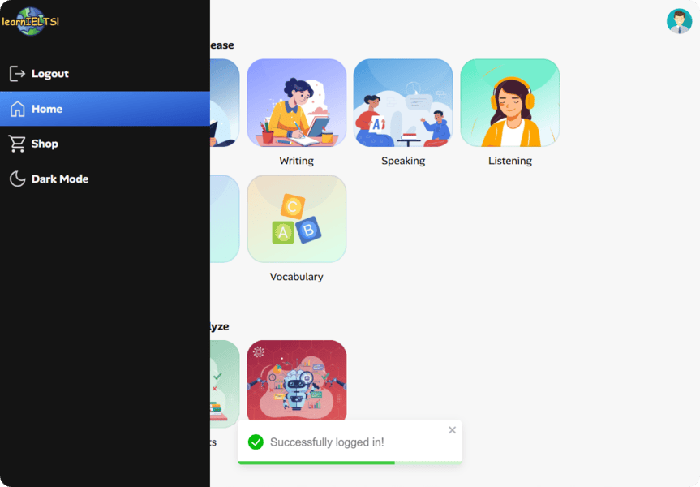
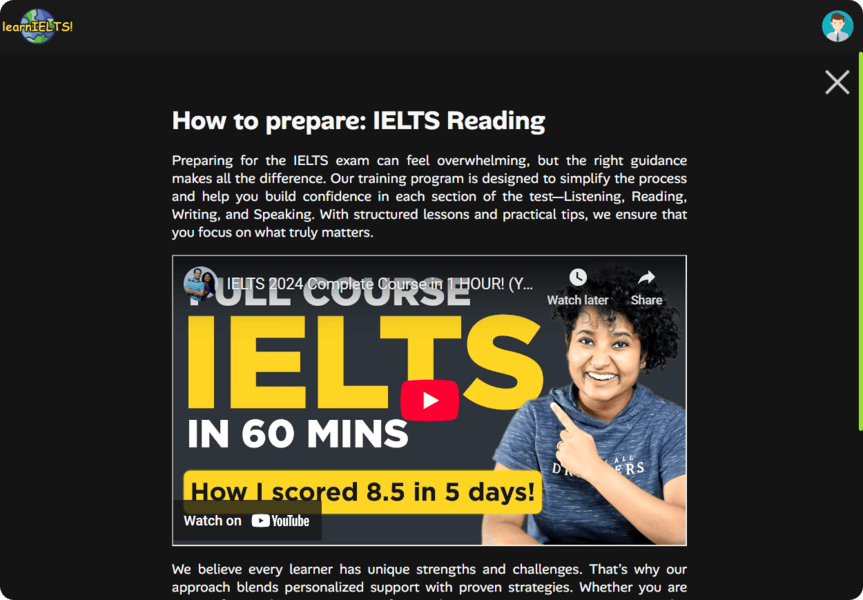
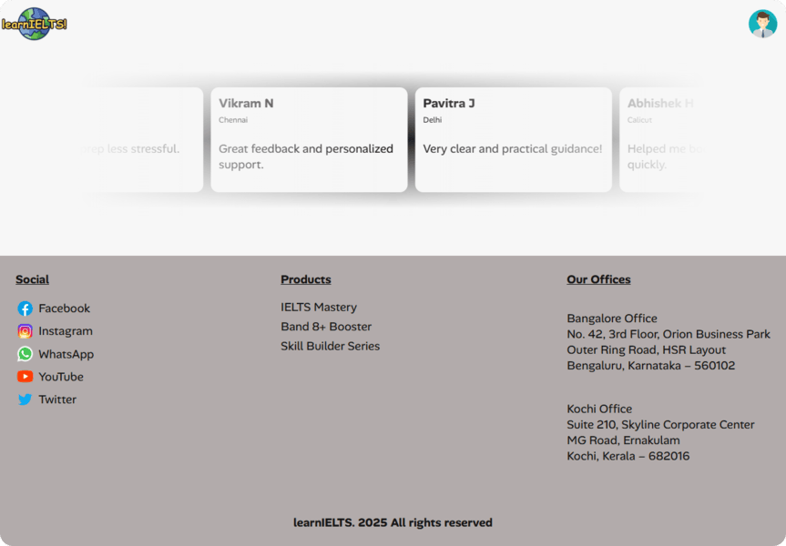

# Setup Instructions

## 1. Clone Repo
```bash
git clone https://github.com/abhishek-0x49310/learn-ielts-react.git
```
```bash
cd learn-ielts-react
```

## 2. Install Dependencies
```bash
npm install
```

## 3. Run development server
```bash
npm run dev
```

## 4. Run production server
```bash
npm run build
npx serve dist
```

# ℹ️ About the Project

This is an IELTS Training Website built using React and Vite. It provides a frontend-only experience without a real backend. 

The project includes dummy login and signup functionality that simulates backend behavior — users can log in and interact with the app without any actual email or password verification. Similarly, the app imitates receiving and displaying data as if it were coming from a server.

All features are fully functional on the frontend, demonstrating UI design, animations, responsive layouts, and interactivity.

# 🖼️ UI Samples












